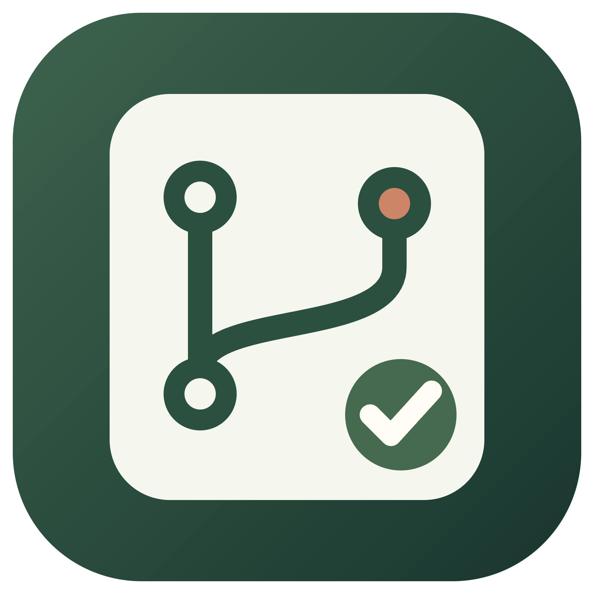

<p align="center">
  
</p>

<h1 align="center">Diff Wingman</h1>

<p align="center">
  在本地把代码差异、AI 导读和人工审查证据放到同一个工作区。
</p>

<p align="center">
  
  
  
  
</p>

Diff Wingman 是一个本地代码审查工具，适合在 AI 参与开发后梳理真实改动。它从 Git 读取固定快照，在 diff 旁展示需求、调用上下文、Codex 导读、人工判断和验证结果，帮助审查者弄清楚代码改了什么、为什么改、影响可能在哪里。

> 当前版本是早期预览版，主要面向个人本地审查。它不会替代人工判断，也不会自动批准、修改或合并代码。

## 功能

| 能力 | 当前实现 |
| --- | --- |
| Git diff | 比较两个提交，也可审查暂存区、工作区和明确选中的未跟踪文件 |
| 版本选择 | 从分支、远端分支、Tag 和 HEAD 中选择，支持搜索或手动输入 commit |
| 文件浏览 | 列表/树形视图、文件展开/折叠 |
| Diff 阅读 | 并排/内联布局、空白变更开关、单文件阅读模式 |
| AI 导读 | 使用 Codex 生成阅读路线、需求对照和流程步骤；大 diff 自动分批分析并合并 |
| 影响上下文 | 为 JS、TS、JSX 变更补充函数范围、定义和静态引用 |
| 人工审查 | 保存笔记、逐条判断、核实依据和 Markdown 审查报告 |
| 隔离验证 | 在无网络、只读源码的 Docker 容器中运行选定的项目脚本 |
| GitLab MR | 只读导入 MR，在 diff 行上保存本地评论草稿并检查版本是否过期 |

## 快速开始

### 环境要求

- Node.js 20.19 或更高版本
- pnpm 10
- Git
- [Codex CLI](https://developers.openai.com/codex)（使用 AI 导读时需要）
- Docker（运行隔离验证时需要）

### 浏览器版本

```bash
git clone https://github.com/CallmeJay/diff-wingman.git
cd diff-wingman
pnpm install
pnpm dev
```

打开终端输出的地址，默认是 <http://127.0.0.1:4318>。

### macOS 桌面版本

桌面构建需要 Node.js 22.12 或更高的 22.x 版本。

```bash
pnpm install
pnpm desktop:dev
```

生成本机 `.app` 或 macOS ZIP：

```bash
pnpm desktop:package
pnpm desktop:make
```

当前应用尚未签名或公证，生成结果只适合本机使用。

## 使用流程

1. 选择本地 Git 仓库，指定两个版本，或选择暂存区、工作区、GitLab MR。
2. 填写本次需求和不得改变项，创建固定源码快照。
3. 浏览文件 diff；需要时生成 AI 阅读路线或查看符号引用。
4. 记录逐条判断、核实依据和验证结果。
5. 导出 Markdown 审查报告。

所有笔记和人工状态都绑定到对应快照。源码或 MR 版本变化后，旧记录会标记为待重核。

## Codex 配置

Diff Wingman 通过官方 Codex CLI 调用模型。首次使用前登录 ChatGPT：

```bash
codex login
codex login status
```

点击生成或追问时，选中的源码上下文和需求会发送到 Codex 服务并消耗账号额度。本地读取 Git 不会调用模型，工具也不会读取或复制 Codex 的 `auth.json`。

## GitLab MR

读取私有 GitLab MR 前设置：

```bash
export REVIEW_HELPER_GITLAB_HOST=gitlab.example.com
export REVIEW_HELPER_GITLAB_TOKEN=your_read_only_token
```

令牌只用于读取 MR。Diff Wingman 不会向 GitLab 发布评论、批准或合并 MR；评论草稿保存在本机。MR 对应的提交必须已经存在于本地仓库，工具不会自动执行 `git fetch`。

## 安全边界

- Git 访问是只读的，不会 checkout、修改 index 或写入被审查仓库。
- Codex 在只读沙箱中运行，关闭命令执行和不需要的外部能力。
- Docker 验证关闭网络，挂载只读源码，并限制资源、运行时间和输出大小。
- 静态引用和 AI 解释都是审查线索，不代表运行时一定可达，最终结论由 reviewer 确认。
- 源码快照、导读、笔记和报告保存在本机；默认目录不会提交到 Git。

完整限制见[第五版范围说明](docs/v5-scope.md)与[验收记录](docs/v5-verification.md)。

## 配置

| 环境变量 | 用途 | 默认值 |
| --- | --- | --- |
| `REVIEW_HELPER_PORT` | 浏览器版本监听端口 | `4318` |
| `REVIEW_HELPER_DATA_DIR` | 本地审查记录目录 | 项目内 `.review-helper/` |
| `REVIEW_HELPER_GITLAB_HOST` | GitLab 域名 | 无 |
| `REVIEW_HELPER_GITLAB_TOKEN` | GitLab 只读令牌 | 无 |
| `REVIEW_HELPER_VERIFY_IMAGE` | Docker 验证镜像 | `node:22-alpine` |

打包后的 macOS 应用默认把记录保存在 `~/Library/Application Support/Diff Wingman/reviews/`。

## 开发

```bash
pnpm build
pnpm check:git
pnpm check:guide
pnpm check:server
pnpm check:v2
pnpm check:v3
pnpm check:v4
pnpm check:v5
```

Docker Desktop 正在运行且本机已有验证镜像时，可以执行真实容器验收：

```bash
pnpm check:v4:docker
```

主要目录：

```text
src/web/       React 审查界面
src/server/    Git、Codex、GitLab、报告和验证逻辑
src/electron/  macOS 桌面入口
src/shared/    数据类型与运行时契约
tests/         Git、HTTP、符号分析和 Docker 验收
docs/          版本范围、验收记录和开发计划
```

## 文档

- [开发路线图](docs/roadmap.md)
- [第一版范围](docs/scope.md) / [验收记录](docs/verification.md)
- [第二版范围](docs/v2-scope.md) / [验收记录](docs/v2-verification.md)
- [第三版范围](docs/v3-scope.md) / [验收记录](docs/v3-verification.md)
- [第四版范围](docs/v4-scope.md) / [验收记录](docs/v4-verification.md)
- [第五版范围](docs/v5-scope.md) / [验收记录](docs/v5-verification.md)

## 开源许可

Diff Wingman 使用 [MIT License](LICENSE)。
